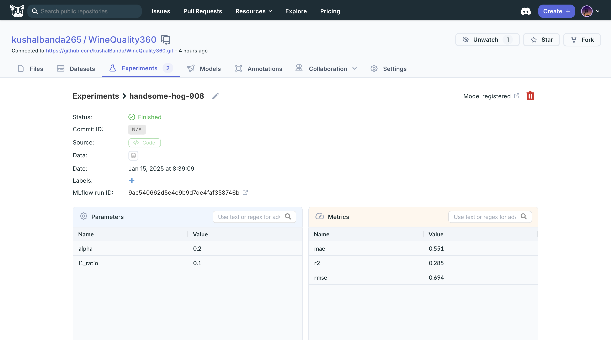
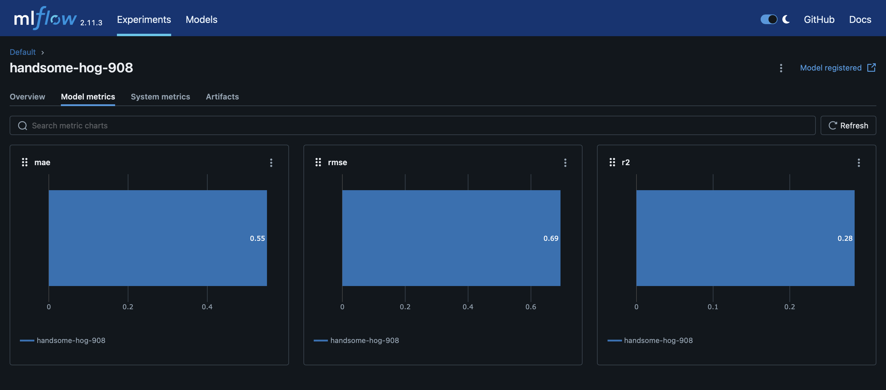

# 🚀 End to End Wine Quality Project

* Where you can predict your Quality of wine based on few parameters.

---

## 🌟 **About This Project**

This repository contains **state-of-the-art features** powered by cutting-edge tools like DagsHub and MLflow. Designed to push the boundaries of innovation, this project offers unparalleled insights and performance optimization.

- 💡 **Purpose**: Revolutionize the way data and models are managed.
- 🎯 **Objective**: Empower data teams with seamless experiment tracking, metrics analysis, and collaboration.

---

## 🛠️ **Features**

- 🔍 **Experiment Tracking**: Centralized storage for experiments with full transparency.
- 📊 **Metrics Visualization**: Stunning insights and metric breakdown for informed decisions.
- 🌐 **Collaboration**: Integrate effortlessly with DagsHub & MLflow.
- 🧠 **Scalability**: Designed to handle large-scale projects with ease.

---

## ⚙️ **Installation**

1. Clone the Repository:
   ```bash
   git clone https://github.com/kushalBanda/WineQuality360.git
   ```
2. Navigate to the Directory:
   ```bash
   cd WineQuality360
   ```
3. Install Requirements:
   ```bash
   pip install -r requirements.txt
   ```

---

## 🚀 **Usage**

1. **Start the Application**Run the application with the following command:

   ```bash
   python app.py
   ```
2. **Track Experiments**Access the MLflow UI at: `http://127.0.0.1:8080`
3. **Sync with DagsHub**
   Configure your DagsHub integration using `config.yaml`.

---

## 🛠️ **Workflows - ML Pipeline**

1. **Data Ingestion**
2. **Data Validation**
3. **Data Transformation**
4. **Model Trainer**
5. **Model Evaluation**

---

## 🔄 **Workflow Steps**

1. Update `config.yaml`
2. Update `schema.yaml`
3. Update `params.yaml`
4. Update the entity files
5. Update the configuration manager in `src/config`
6. Update the components
7. Update the pipeline
8. Update `main.py`

---

## 📊 **Dashboard Previews**

### DagsHub Experiments:



### MLflow Metrics:



---

## 🌐 **Integrations**

- [DagsHub](https://dagshub.com): A collaboration-first platform for managing machine learning projects.
- [MLflow](https://mlflow.org): The ultimate open-source framework for lifecycle tracking.

---

## 💬 **Contributing**

Contributions are more than welcome! Please read the [CONTRIBUTING.md](CONTRIBUTING.md) file for guidelines.

---

## 🙌 **Acknowledgements**

Special thanks to:

- **Your Name** for orchestrating this brilliance.
- **Community** for inspiration.

---

## 📜 **License**

This project is licensed under the MIT License. See [LICENSE](LICENSE) for details.

---

Feel free to personalize this further with your unique style, logos, and additional sections!
